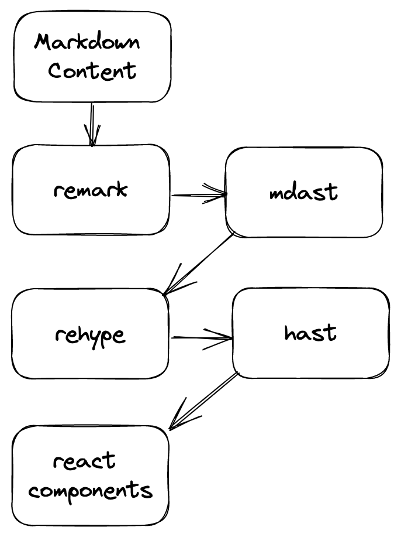
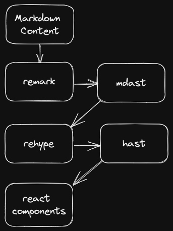

Getting images right and fast on the web is hard.
If we are doing it wrong,
we create a poor user experience with slow loading times and
CLS ([Cumulative Layout Shift](https://blog.hubspot.com/marketing/cumulative-layout-shift#:~:text=What%20is%20Cumulative%20Layout%20Shift,constitute%20a%20large%20CLS%20score.)).

## next/image

In [Next.js](https://nextjs.org/) we can use the [next/image](https://nextjs.org/docs/api-reference/next/image) component to avoid this bad user experience.
`next/image` automatically optimizes our images in three ways to reduce the slow loading times:

- Converts the image to the smallest supported format
- Resizes the image based on the used device viewport
- Uses image compression

It also creates a placeholder to avoid the CLS.
The following example shows the usage of `next/image` with a static image:

```tsx
import picture from "./pictures/mountain.jpg";

<Image src={picture} alt="Picture of a mountain" placeholder="blur" />;
```

## Markdown

This looks great, but how can we use it in our markdown files?

### MDX

My first reaction was to use [MDX](https://mdxjs.com/) and use `next/image` just as in the example.
But that means that we can't use normal markdown images and
it turns out that this won't work with [contentlayer](https://www.contentlayer.dev/).
It won't work, because [Next.js](https://nextjs.org/) does some magic on the import of the static image.
The object which gets returned by the import
contains not only a path to the image,
it contains also the width and height
plus a very small version of the image for the blurred placeholder.
This magic does not work if the [MDX](https://mdxjs.com/) file is loaded with [contentlayer](https://www.contentlayer.dev/),
because [contentlayer](https://www.contentlayer.dev/) uses its own bundler,
which knows nothing about the import magic for images.

### The trick with the public folder

The next idea was to use normal markdown images and to place the images in the `public` folder.
This eliminates the need for static imports and treats our image like a remote image.
But in order to make this work, we have to tell `next/image` the dimensions of the image.
If we would use a static import for the image,
the import magic would provide the dimensions for us.
To pass the width and height to the image component we use a [rehype](https://github.com/rehypejs/rehype) plugin called [rehype-img-size](https://github.com/ksoichiro/rehype-img-size).

<CH.Code>

```bash pnpm
pnpm add -D rehype-img-size
```

```bash yarn
yarn add -D rehype-img-size
```

```bash npm
npm install --save-dev rehype-img-size
```

</CH.Code>

After installation we can configure [contentlayer](https://www.contentlayer.dev/) to use the plugin within [MDX](https://mdxjs.com/),
but it should work with [markdown](https://www.contentlayer.dev/docs/reference/source-files/make-source#markdown) too.

```javascript contentlayer.config.js focus=5
export default makeSource({
  contentDirPath: "content/posts",
  documentTypes: [Post],
  mdx: {
    rehypePlugins: [[rehypeImgSize, { dir: "public" }]],
    remarkPlugins: [],
  },
});
```

The plugin will now find each image in the markdown content and pass its dimensions to the image component.
If we have the following markdown content...

```markdown

```

... [rehype-img-size](https://github.com/ksoichiro/rehype-img-size) will look up
`pictures/mountain.jpg` in the `public` directory (as configured in the contentlayer config) and
calculate its size.
Now we can replace the image component with `next/image`:
<a id="replace-img-with-next-image"></a>
```tsx components/Markdown.tsx
import { useMDXComponent } from "next-contentlayer/hooks";
import Image from "next/image";

type Props = {
  code: string;
};

const Markdown = ({ code }: Props) => {
  const MDXComponent = useMDXComponent(code);
  return (
    <section className="prose prose-zinc">
      <MDXComponent
        components={{
          img: Image,
        }}
      />
    </section>
  );
};

export default Markdown;
```

And that's it, we are now using `next/image` to render our markdown images.
This approach works, but it is not ideal, because the images can't be located next to the content.
They have to be placed in the `public` directory.

<FileTree
  nodes={[
    {
      type: "directory",
      name: "content/posts",
      children: [
        {
          type: "file",
          name: "2022-12-11-sample.mdx",
        },
      ],
    },
    {
      type: "directory",
      name: "public/pictures",
      children: [
        {
          type: "file",
          name: "mountain.jpg",
        },
      ],
    },
  ]}
/>

It would be better if we could locate the images right next to the content:

<FileTree
  nodes={[
    {
      type: "directory",
      name: "content/posts/2022-12-11-sample",
      children: [
        {
          type: "directory",
          name: "assets",
          children: [
            {
              type: "file",
              name: "mountain.jpg",
            },
          ],
        },
        {
          type: "file",
          name: "index.mdx",
        },
      ],
    },
  ]}
/>

We also don't have the small image for the blurred placeholder,
we can only use the `empty` placeholder.

If these two things are not so important to you, this is the right approach.

### Custom rehype plugin

To fix the two weaknesses from the last approach, we can write a custom [rehype](https://github.com/rehypejs/rehype) plugin.
Our plugin should do the following things:

* Copy the image from its location to the public folder
* Update the `src` attribute to the new location
* Calculate the width and height
* Create small image for blurred placeholder

Before we write this plugin,
we should understand how the markdown processing works in [contentlayer](https://www.contentlayer.dev/).

[contentlayer](https://www.contentlayer.dev/) uses [remark](https://github.com/remarkjs/remark) to parse the markdown into a [mdast](https://github.com/syntax-tree/mdast).
We can now use `remark plugins` to modify the `mdast`.
Then `rehype` comes into play and converts the `mdast` into a [hast](https://github.com/syntax-tree/hast).
`rehype plugins` can now modify the `hast`.
Finally the `hast` is converted into [react](https://reactjs.org/) components.

<figure className="w-80 dark:hidden">

</figure>
<figure className="w-80 hidden dark:block">

</figure>

For our plugin we have to modify the `hast`,
because images in the `mdast` don't have width or height and they don't support custom properties.
The `hast` on the other hand supports all properties of the HTML `img` component and
we can pass custom properties.

#### Implementation

We start our plugin by defining the options:

* publicDir: path to the public directory

Then we can define our plugin.
The plugin is a function which gets the options and returns another function which receives the following parameters:

* tree: the whole `hast`
* file: the parsed file with path and content
* done: a function which should be called when our plugin has finished

Our plugin searches the `hast` tree and for each element with the `tagName` `img`
we call the `processImage` function.
`rehype` plugins can't be async, but image processing is async.
That's the reason why we store each resulting `Promise` of the `processImage` function in an array and
call the `done` function if all `Promises` are resolved and the work is done.

```ts lib/static-images.ts
type Options = {
  publicDir: string;
};

const staticImages: Plugin<[Options], Root> = (options) => (tree, file, done) => {
  const tasks: Promise<void>[] = [];

  visit(tree, "element", (node) => {
    if (node.tagName === "img") {
      tasks.push(processImage(options, file, node));
    }
  });

  Promise.all(tasks).then(() => done());
};

const processImage = async (options: Options, file: VFileWithOutput<unknown>, node: Element): Promise<void> => {
  // implementation comes next
}

export default staticImages;
```

Ok, now we can have a detailed look at the implementation of the `processImage` function.
At first we have to find the real path of the image.
Fortunately, contentlayer stores information about the location of our markdown file in the `data` field of the `file`.

```ts lib/static-images.ts
// find the content directory
const root = file.dirname || process.cwd();

// find the directory of the markdown file
// RawDocumentData is an import from contentlayer/source-files
const data = file.data as { rawDocumentData: RawDocumentData };
const directory = data.rawDocumentData.sourceFileDir;

// get the path of the image from the src attributes
const filePath = image.properties?.src as string || "";

// create the path by joining root, directory and filePath
// path is imported from node:path
const imagePath = path.join(root, directory, filePath)
```

Now that we have the path we can use [sharp](https://sharp.pixelplumbing.com/) to read the width and height of the image.

```ts lib/static-images.ts
// sharp is an import from sharp (@types/sharp)
const image = await sharp(imagePath);

// get the width and height of the image
const { width, height } = await image.metadata();
```

After that we can create a small version of the image for the blurred placeholder.
We will create a `png` with a `quality` of `75`, a width of `8px` and we keep the aspect ratio.

```ts lib/static-images.ts
const imgAspectRatio = width / height;
const blurDataURL = await image
  .resize(8, Math.round(8 / imgAspectRatio))
  .png({
    quality: 75,
  })
  .toBuffer()
  .then((buffer) => `data:image/png;base64,${buffer.toString("base64")}`);
```

Then we can copy the image to the `public` folder and create a new path for the `src` attribute of the image.

```ts lib/static-images.ts
const src = path.join(directory, filePath);
const target = path.join(options.publicDir, src);

await fs.mkdir(path.dirname(targetDir), { recursive: true });
await fs.copyFile(imagePath, target);
```

With all the information in place we can update the properties of the `img` tag.

```ts lib/static-images.ts
node.properties = {
  ...node.properties,
  width,
  height,
  src: path.join("/", src),
  blurDataURL,
};
```

After we have finished writing our plugin, it is time to configure contentlayer.

```javascript contentlayer.config.js focus=7
import mdxImages from "./lib/static-images";

export default makeSource({
  contentDirPath: "content/posts",
  documentTypes: [Post],
  mdx: {
    rehypePlugins: [[mdxImages, { publicDir: path.join(process.cwd(), "public") }]],
    remarkPlugins: [],
  },
});
```

<Notification>
  Don't forget to replace the `img` tag with `next/image`.
  As we have seen in the <a href="#replace-img-with-next-image">rehype-img-size method</a>.
</Notification>

### Conclusion

Ok, let's summarize again what we have achieved.

We have written a `rehype` plugin, which does the following steps fully automatic for us:

* Copy the image from its location to the public folder
* Update the `src` attribute to the new location
* Calculate the width and height
* Create a small image for the blurred placeholder

With this plugin we can use the normal markdown image syntax and gain all the benefits of `next/image`:

- Smallest supported format
- Resized version based on the used device viewport
- image compression

For a more complete example have a look at the [article's source code](https://github.com/sdorra/sdorra.dev/blob/main/lib/static-images.ts).
