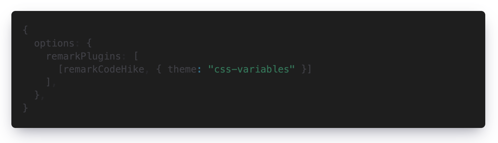
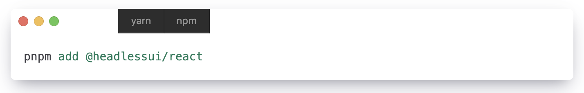

<Notification type="warning">
  This article refers to versions of [Code Hike](https://codehike.org/) before
  [0.8.0](https://github.com/code-hike/codehike/releases/tag/v0.8.0). Since version
  [0.8.0](https://github.com/code-hike/codehike/releases/tag/v0.8.0), Code Hike uses
  [lighter](https://github.com/code-hike/lighter) instead of [Shiki](https://shiki.matsu.io/). The approach presented in
  this article uses [shiki's color replacement method](https://github.com/shikijs/shiki/pull/314), which no longer works
  with [lighter](https://github.com/code-hike/lighter).
</Notification>

I'm using [Code Hike](https://codehike.org/) a lot, including for the code snippets on my blog, and I love this library.
It has many nice features, like [tabs](https://codehike.org/demo/filenames) or [focus](https://codehike.org/demo/code).
But it is lacking support for switching themes at runtime, which I want to use for a dark mode implementation.

https://github.com/code-hike/codehike/issues/271

That is really a pity.
But why actually?
Code Hike uses [Shiki](https://shiki.matsu.io/) and [Shiki](https://shiki.matsu.io/) supports [changing themes via CSS variables](https://github.com/shikijs/shiki/blob/main/docs/themes.md#1-use-the-css-variables-theme).
We should try that out?

## Shiki

In order to switch [Shiki](https://shiki.matsu.io/) colors at runtime,
we have to load a special theme which uses [CSS variables](https://developer.mozilla.org/en-US/docs/Web/CSS/Using_CSS_custom_properties) instead of hard coded colors.
This should look like this:

```javascript
{
  options: {
    remarkPlugins: [
      [remarkCodeHike, { theme: "css-variables" }]
    ],
  },
}
```

After that we can define our colors for the theme with css variables:

```css
:root {
  --shiki-color-text: #24292f;
  --shiki-color-background: #ffffff;
  --shiki-token-constant: #0550ae;
  --shiki-token-string: #24292f;
  --shiki-token-comment: #6e7781;
  --shiki-token-keyword: #cf222e;
  --shiki-token-parameter: #24292f;
  --shiki-token-function: #8250df;
  --shiki-token-string-expression: #0a3069;
  --shiki-token-punctuation: #24292f;
  --shiki-token-link: #000012;
}
```

And we can override them for the dark mode:

```css
@media (prefers-color-scheme: dark) {
  :root {
    --shiki-color-text: #c9d1d9;
    --shiki-color-background: #0d1117;
    --shiki-token-constant: #79c0ff;
    --shiki-token-string: #a5d6ff;
    --shiki-token-comment: #8b949e;
    --shiki-token-keyword: #ff7b72;
    --shiki-token-parameter: #c9d1d9;
    --shiki-token-function: #d2a8ff;
    --shiki-token-string-expression: #a5d6ff;
    --shiki-token-punctuation: #c9d1d9;
    --shiki-token-link: #000012;
  }
}
```

### Tailwind CSS

If you use [Tailwind CSS](https://tailwindcss.com/) and use the dark mode with the class strategy instead of media query,
you can override the variables like this:

```css
html.dark {
  --shiki-color-text: #c9d1d9;
  --shiki-color-background: #0d1117;
  --shiki-token-constant: #79c0ff;
  --shiki-token-string: #a5d6ff;
  --shiki-token-comment: #8b949e;
  --shiki-token-keyword: #ff7b72;
  --shiki-token-parameter: #c9d1d9;
  --shiki-token-function: #d2a8ff;
  --shiki-token-string-expression: #a5d6ff;
  --shiki-token-punctuation: #c9d1d9;
  --shiki-token-link: #000012;
}
```

<Notification type="info" title="Bonus" prose>
You can use colors from [Tailwind CSS](https://tailwindcss.com/docs/customizing-colors) by using the [theme function](https://tailwindcss.com/docs/functions-and-directives#theme):

```postcss
:root {
  --shiki-color-text: theme("colors.zinc.700");
  --shiki-color-background: theme("colors.white");
  --shiki-token-constant: theme("colors.emerald.700");
  --shiki-token-string: theme("colors.emerald.700");
  --shiki-token-comment: theme("colors.zinc.500");
  --shiki-token-keyword: theme("colors.cyan.700");
  --shiki-token-parameter: theme("colors.pink.700");
  --shiki-token-function: theme("colors.violet.700");
  --shiki-token-string-expression: theme("colors.emerald.700");
  --shiki-token-punctuation: theme("colors.zinc.800");
  --shiki-token-link: theme("colors.zinc.700");
}
```
</Notification>

## Code Hike

Ok, now we have everything together let's test it.
Most of the colors are now loaded from our variables, but not all.



The background and the default text color are always very dark.
Why is that?
After some time of searching in the source code of [Code Hike](https://github.com/code-hike/codehike), I found the answer.
It reads some color information from the theme itself ([theme.ts](https://github.com/code-hike/codehike/blob/b3350c399b963b0ca0647b452ec737c89f1f81df/packages/mdx/src/utils/theme.ts#L73)).
But shouldn't it then get variables instead of hard coded blackish color codes?
After a look into the [Shiki theme](https://github.com/shikijs/shiki/blob/main/packages/shiki/themes/css-variables.json),
I have to realize that there are no variables defined.
After another research phase, I found out that [Shiki](https://github.com/shikijs/shiki) does some weird color code to variable replacement.

https://github.com/shikijs/shiki/pull/314

Shiki does this because the underlying library [vscode-textmate](https://github.com/microsoft/vscode-textmate) or [vscode-oniguruma](https://github.com/microsoft/vscode-oniguruma) returns black if the value is not a valid color.
This explains why [Code Hike](https://github.com/code-hike/codehike) uses blackish color codes instead of variables.
But what if we write a variable directly into the theme instead of the color code.

### Custom theme

At first we copy the [css-variables theme](https://github.com/shikijs/shiki/blob/main/packages/shiki/themes/css-variables.json) from [Shiki](https://shiki.matsu.io/) and
modify the values of `editor.foreground` and `editor.background` from the blackish color codes to variables.

```json
{
  "name": "css-variables",
  "type": "css",
  "colors": {
    "editor.foreground": "var(--shiki-color-text)",
    "editor.background": "var(--shiki-color-background)",
  },
  ...
}
```

Now we can load our custom theme.

```javascript
import { remarkCodeHike } from "@code-hike/mdx";
import theme from "./lib/ch-theme.json" assert { type: "json" };

const options = {
  remarkPlugins: [[remarkCodeHike, { theme }]],
};

// configure mdx ...
```

Great, that seems to work.
But what about tabs, if we use `CH.Code`?



After some research in the source code,
we add some more variables to our theme and to our css:

<CH.Code>

```json theme.json
"colors": {
  "editor.foreground": "var(--shiki-color-text)",
  "editor.background": "var(--shiki-color-background)",

  "editorGroupHeader.tabsBackground": "var(--ch-tabs-bg)",
  "tab.activeBackground": "var(--ch-tab-active-bg)",
  "tab.inactiveForeground": "var(--ch-tab-inactive-color)",
  "tab.inactiveBackground": "var(--ch-tab-inactive-bg)",
  "icon.foreground": "var(--ch-icon-text)",

  "tab.border": "var(--ch-tab-border)",
  "tab.activeBorder": "var(--ch-tab-active-border)",
},
```

```css styles.css
:root {
  --ch-icon-text: #3f3f46;
  --ch-tabs-bg: #e4e4e7;
  --ch-tab-border: #d4d4d8;
  --ch-tab-active-border: #ffffff;
  --ch-tab-active-bg: #ffffff;
  --ch-tab-active-color: #3f3f46;
  --ch-tab-inactive-color: #71717a;
  --ch-tab-inactive-bg: #e4e4e7;
}
```

</CH.Code>

But the color definition for `tab.activeForeground` caused problems.
[Code Hike](https://codehike.org/) tries to convert the color from hex to rgba in order to add opacity to the color ([transparent](https://github.com/code-hike/codehike/blob/next/packages/mdx/src/utils/color.ts#L68)).
But our color definition (`var(--ch-tab-active-color`) is not a hex color code and the function throws an error.
With a bit of css we are able to workaround the problem:

```css
div.ch-editor-tab-active {
  color: var(--ch-tab-active-color);
}
```

That's it, we can now use CSS variables for the style of our syntax highlighting
and we can use different themes for light and dark mode.

<Notification type="warning">
  I've tested not all feature of Code Hike. It is very likely that there will still be problems at one point or another.
</Notification>

## Existing Themes

That is all nice, but how can we use existing VS Code themes with this approach (Shiki and Code Hike are using VS Code themes).
We have to read the theme and copy the color codes from the theme to our css variables.
But this is a very tedious work, so I have written a small tool that can take this task from us.

```bash
$ npx convert-sh-theme https://raw.githubusercontent.com/shikijs/shiki/main/packages/shiki/themes/dracula.json

style.css
=======================================

:root {
  --shiki-color-text: #F8F8F2;
  --shiki-color-background: #282A36;

  --shiki-token-constant: #BD93F9;
  --shiki-token-string: #8BE9FD;
  --shiki-token-comment: #6272A4;
  --shiki-token-keyword: #FF79C6;
  --shiki-token-parameter: #F8F8F2;
  --shiki-token-function: #8BE9FD;
  --shiki-token-string-expression: #FF79C6;
  --shiki-token-punctuation: #F8F8F2;
  --shiki-token-link: #8BE9FD;
}
```

To create styles and the theme for Code Hike:

```bash
$ pnpx convert-sh-theme --code-hike --out output https://raw.githubusercontent.com/shikijs/shiki/main/packages/shiki/themes/dracula.json

... write file style.css
... write file theme.json
```

For more information about the converter tool, have a look at [convert-sh-theme](https://github.com/sdorra/convert-sh-theme).
